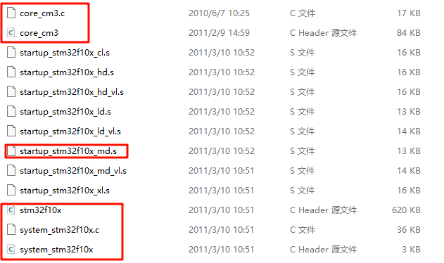
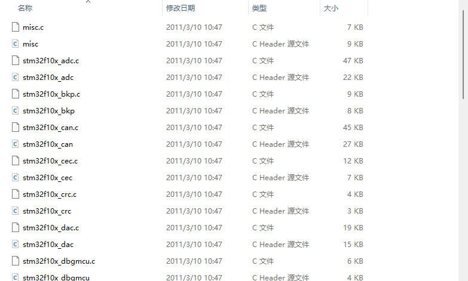
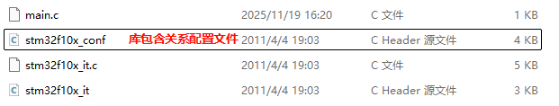
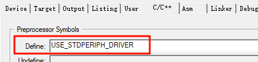
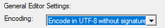
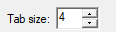
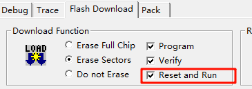

## STM32个人手册

### 一、软件环境安装

#### 1.keil5安装

安装ARM版

#### 2.包安装


点击进入官方包安装界面，更新后，选择需要的芯片包安装。

如`STM32F1`系列，选择右侧的DFP包安装。

#### 3.驱动安装

- **STLINK**
  - keil5 安装目录下   `E:\software\keil_v5\ARM\STLink\USBDriver\dpinst_amd64.exe`
- USB转串口

### 二、新建工程

#### 1.基于标准库函数新建模板工程

- **新建工程**

  - ``Project``-->`new project`-->选择工程文件夹**0-0_DEMO**-->选择具体型号（``STM32F103C8``）
  - 工程文件夹内新建文件夹，`Start`，`Library`，`User`
  - **Start文件夹添加如下图内固件库**，其为启动文件
  - 
  - **Library文件夹添加如下图内固件库**，其为库函数文件
  - 
  - **User文件夹添加如下图内固件库**，其为配置文件
  - 
  - 点击，C/C++选项卡，`Include path`添加新路径，将`Start`，`Library`，`User`路径加入
  - **将所需文件添加至keil工程内对应Group，方法为**
    - 新建`NewGroup`，更改为`Start`，`Library`，`User`对应名称
    - `Start`内添加上图红框标注文件
    - `Library`，`User`添加文件夹内所有文件

- 添加宏定义**USE_STDPERIPH_DRIVER**，用于工程识别`stm32f10x_conf `库包含关系配置文件

  - 

- **新建main.c**

  - 右键`User`，新建`main.c`
  - 注意，下方文件选择`User`文件夹

- **编写基础代码**

  - 右键添加标准头文件

  - ```C
    #include "stm32f10x.h"                  // Device header
    
    int main(void)
    {
    	RCC_APB2PeriphClockCmd(RCC_APB2Periph_GPIOA,ENABLE);
    	GPIO_InitTypeDef GPIO_InitStructure;
    	GPIO_InitStructure.GPIO_Mode=GPIO_Mode_Out_PP;
    	GPIO_InitStructure.GPIO_Pin=GPIO_Pin_7;
    	GPIO_InitStructure.GPIO_Speed=GPIO_Speed_50MHz;
    	GPIO_Init(GPIOA,&GPIO_InitStructure);
    	GPIO_SetBits(GPIOA,GPIO_Pin_7);
    	while(1)
    	{
    		
    	}
    }
    
    ```

  - 

- **基础设置**

  - 更改debug选项卡为`STLINK`

  - 更改`Target`--`Arm Compiler`为5.06

    - 若没有5.06，需手动安装

    - **所需资源：**

      - ARM Compiler 5.06 安装包（例如：`ARMCompiler506_b960.msi`）
      - 通过网盘分享的文件：ARMCompiler506_b960.msi
        链接: https://pan.baidu.com/s/1bgnfly0B2X40SF4-UCRrQQ?pwd=i48j 提取码: i48j 

      **解决步骤：**

      1. **运行安装程序**找到并双击下载好的 `ARMCompiler506_b960.msi`安装文件。
      2. **开始安装**在弹出的安装向导窗口中，点击 **Next**。
      3. **接受许可协议**勾选 **I accept the terms of the License Agreement**，然后点击 **Next**。
      4. **选择安装路径** 建议将编译器安装到Keil MDK的目录下，便于管理。例如，我将其安装到了 `D:\Keil_v5\ARM\ARMCC`（请在ARM文件夹下**新建一个名为ARMCC的文件夹**）。选择好路径后，点击 **Next**。
      5. **添加编译器文件夹**选择 **Folders/Extensions** 选项卡，然后点击右上角的 **三个小点（...）** 按钮添加新编译器**在新弹出的对话框中，点击按钮 **Add another ARM Compiler Version to List...**。**选择编译器路径**浏览并选择您**第一部分第4步中安装的 `ARMCC`文件夹的路径（例如 `D:\Keil_v5\ARM\ARMCC`)，然后点击 **确定**。

  - 调整偏好设置

    - 
    - 
    - fonts设置为14

  - 设置下载后自动`reset`
    - 选择STLINK旁边`setting`，进入`Flash Download`更改
    - 

  

