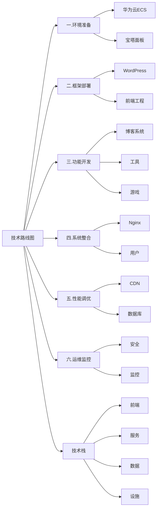

# 网站搭建笔记

---



## 一、环境准备

---

### 云服务器

---

- 华为云服务器

  - 规格：2核2g，40G SSD, 2M带宽， 100G月流量

  - 期限：2025/8/28

  - 账号：15188636576

  - 密码：*1
- 华为云宝塔面板

  -  账号：huazn    

  -  密码：*


### WordPress 建站

---

#### 基础设置

- 网址：[仪表盘 ‹ 记录 — WordPress](http://123.249.100.76/wp-admin/index.php)

- 用户名：huazn

- 密码：TIzp2IOiL9Wr4^w7VL

- 设置：更改固定链接为文章名

- 主题：Astra

- 插件
  - All-in-One WP Migration and Backup   (备份插件)
  - Elementor
  - Envato Elements – Photos & Elementor Templates

#### 技巧

- 高度或宽度单位改为vh，代表视觉值，大概为百分比，好用
- 颜色或样式可以设置全局值，方便更改
- 背景可以覆盖，不影响换设备
- 锚链接：需要链接的部件添加CSSID,链接的部件输入#CSSID
- 响应式：可以设置某些部件或容器只在某些设备显示或隐藏
- 图标
  - 人物：user
  - 日历：calendar


#### 操作流程

- 步骤1：新建页面
  - 页面，添加新页面
  - 点右上角主题按钮，删除页眉页脚
  - 使用elementor编辑
    - 问题：无法打开elementor编辑器
    - 解决：1.关闭浏览器扩展 2.将固定连接改为第一个，固定
  - 点击添加模板
  - 选择hero模板
  - 更改相关设计元素
- 步骤2：添加导航
- 步骤3：添加菜单

#### 图片压缩站  TINYPNG

-  **API:**8F2RJTtsNwZQyCxR9xLnWZCYSD1BYbm9

#### 域名解析

- 华为云购买域名
- 华为云ICP备案
- 华为云域名解析
  - 添加解析
  - 添加华为云服务器ip
- 宝塔面板
  - 网站设置，添加域名
  - 申请免费证书
  - 重载
- WordPress
  - 更改后台链接和站点链接为域名

```python
import pandas as pd
import numpy as np
np.zeros(10)
for a in alist:
    print(a)
```

#### 网站建设遇到问题

1. **将固定链接改为文章名后，链接不可访问**
   - 点击站点设置
   - 伪静态
   - 模板选择----WordPress
   - 重载nginx
2. **自定义全局小部件，如导航栏**
   - 安装插件 Anywhere Elementor
   - 插件页面新建模板
   - 调整模板后，发布
   - AE后台 保存短代码
   - 应用页面插入 简码部件，粘贴短代码
